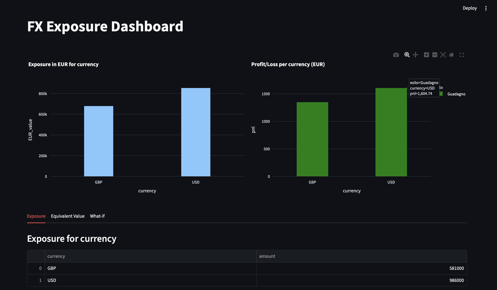

FX Exposure Dashboard

Interactive dashboard for monitoring the currency exposure of a multi-currency 
portfolio, featuring EUR countervalue calculation, FX profit/loss analysis, and 
what-if scenario simulation.
https://reporates-3eelfdjofozcl9mcf77txk.streamlit.app

## Features

- **Exposure by currency** — aggregates open positions for each currency (USD, GBP)
- **EUR countervalue** — converts each position at the most recent exchange rate
- **Historical profit/loss** — compares the exchange rate at the position's opening 
  date with the current one, highlighting gains or losses driven by rate movements
- **What-if scenario** — simulates the impact of a percentage change in the exchange 
  rate on the positions' countervalue

## Tech stack

- **Python** — application logic
- **SQLite** — position storage and exchange-rate caching
- **Streamlit** — interactive web interface
- **Plotly** — data visualization
- **Frankfurter API** — official European Central Bank exchange rates

## How it works

Positions are generated as realistic sample data. Exchange rates are fetched from 
the Frankfurter API and stored in a local cache with a composite key (currency, 
date), which makes it possible to reconstruct a position's countervalue at any 
historical date without repeated API calls.

## Running locally

```bash
pip install -r requirements.txt
streamlit run rates_App.py
```

## Screenshot


